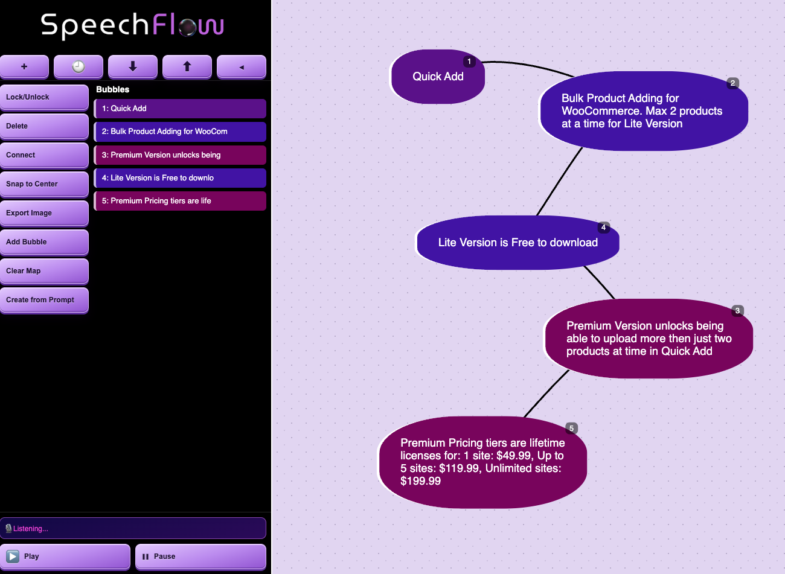

# SpeechFlow

SpeechFlow is a browser-based mind-mapping workspace with draggable bubbles, voice capture, zoom/pan canvas controls, map history, and playback tools.

## Current UI Snapshot



## Features

- Voice-to-bubble capture using Web Speech API (`en-US`)
- Bubble graph editing:
  - Drag bubbles, connect bubbles, relabel connections
  - Reorder playback by dragging bubble rows in the sidebar
  - Bubble action modal (edit text, change type, set order, delete)
- Collapsible sidebar with:
  - Compact icon-only mode
  - Separate audio control zone at the bottom
  - Top action strip (`new map`, `history`, `export`, `import`, `collapse`)
- Map management:
  - New map modal with map naming and bubble type setup
  - Local map history database (stored in `localStorage`)
  - JSON import/export
- Canvas interaction:
  - Left-drag panning on workspace background
  - Mouse-wheel zoom with wide zoom range
- Visual design:
  - Lilac pegboard-style canvas background
  - 3D purple gradient controls
  - Full logo in expanded mode, compact logo in collapsed mode

## Logo Assets

- Expanded logo: `./assets/images/SpeechFlow.png`
- Collapsed logo: `./assets/images/spflowlogosmall.png`

## Run Locally

This is a static web app.

1. Open `index.html` directly in a modern Chromium-based browser, or
2. Serve the directory with any static file server.

Example:

```bash
python3 -m http.server 8080
```

Then open:

- [http://localhost:8080](http://localhost:8080)

## Data Storage

The app stores map/session data in `localStorage`, including:

- `bubbleHistory` (undo/redo timeline)
- `mapDatabase` (saved map records for history modal)

## Notes

- The app relies on browser speech APIs (`SpeechRecognition` / `webkitSpeechRecognition`) and speech synthesis availability.
- For best experience, use latest Chrome.
